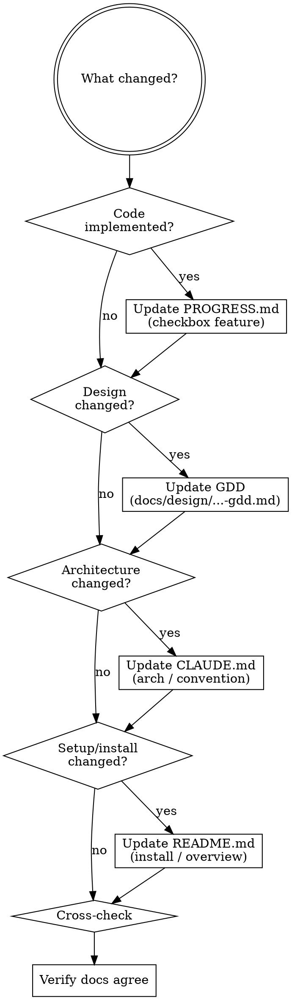

> **Authoritative source**: query the `godot-docs` MCP server before emitting any Godot 4.x API in code or examples — class names, method signatures, signal payloads, and feature availability change between minor versions. Pre-trained knowledge drifts; the MCP does not. If `godot-docs` MCP is unavailable, link the equivalent page on https://docs.godotengine.org/en/stable/ instead of guessing. (See the `using-godot-superpowers` skill for the full rule.)

# Update Project Docs

Keeps every project doc in sync — both the **core docs** (README, GDD, whole-game plan, PROGRESS, CLAUDE) and any **feature artifacts** (surveys, specs, feature plans) that exist. Only touches the ones that are present; does not force a project to adopt every doc type.

## Doc set (core + feature artifacts)

| Doc | Purpose | Update when |
|-----|---------|-------------|
| `README.md` | What the project is, how to run it, top-level overview | Tech stack changes, install steps change |
| `docs/design/<YYYY-MM-DD>-<slug>-gdd.md` | Game Design Document — design intent | Design decisions made (use `gdd-writer`) |
| `docs/plans/<YYYY-MM-DD>-<slug>-plan.md` | Whole-game implementation plan — milestones, skills, deliverables | Plan revised (use `writing-game-plan`) |
| `docs/features/<YYYY-MM-DD>-<slug>-survey.md` | Feature codebase survey — files / APIs / hotspots | Whenever a new feature lands on existing code (use `codebase-survey`) |
| `docs/features/<YYYY-MM-DD>-<slug>-feature.md` | Feature spec — design delta on top of GDD | New feature designed (use `feature-spec`) |
| `docs/plans/<YYYY-MM-DD>-<slug>-feature-plan.md` | Feature implementation plan | Feature plan revised (use `feature-plan`) |
| `PROGRESS.md` | Status: GDD/spec → code mapping, divergences | After every implementation |
| `CLAUDE.md` | Architecture and conventions for Claude Code | New subsystem, new convention, new module |

`PROGRESS.md` and `CLAUDE.md` are optional but recommended on any project larger than ~10 scenes. The `docs/features/*` trio only exists on projects that adopt feature-mode (trail B).

## Decision flow



## Modes

| Invocation | Action |
|------------|--------|
| `/update-docs` or `/update-docs all` | Read all docs + relevant code, cross-check, update everything that needs updating |
| `/update-docs progress` | PROGRESS.md only (after implementation) |
| `/update-docs gdd` | GDD only (after design decision) |
| `/update-docs claude-md` | CLAUDE.md only (after architecture change) |
| `/update-docs readme` | README.md only (after setup/tech stack change) |
| `/update-docs check` | Cross-check only — flag divergences without writing |

## Step 1 — Read current state

Always read all docs that exist before modifying any of them:

```
1. Read README.md                              -> overview baseline
2. Read docs/design/*-gdd.md (latest)          -> design baseline (if exists)
3. Read docs/plans/*-plan.md  (latest)         -> whole-game plan baseline (if exists)
4. Read docs/features/*-survey.md  (each)      -> feature surveys (if any)
5. Read docs/features/*-feature.md (each)      -> feature specs (if any)
6. Read docs/plans/*-feature-plan.md (each)    -> feature plans (if any)
7. Read PROGRESS.md                            -> implementation status (if exists)
8. Read CLAUDE.md                              -> architecture baseline (if exists)
```

Then read code in `scripts/`, `autoload/`, `scenes/` to verify what's actually implemented.

## Step 2 — Update PROGRESS.md

For each feature touched, update its status:

```markdown
- [ ]  -> not implemented (no code)
- [~]  -> partial (code exists but incomplete vs GDD)
- [x]  -> complete and matches GDD
- [?]  -> intentional divergence from GDD (document below)
```

**Rules:**
- Don't mark `[x]` if the feature works but diverges from GDD — use `[?]` and document.
- If a GDD feature has no entry in PROGRESS.md, add it.
- Update "Last updated: YYYY-MM-DD" at top of file.

## Step 3 — Update GDD (only when design changed)

Modify only if:
- A mechanic was redefined
- A balance value was intentionally changed
- A new feature was designed (not just implemented)
- A `[HYPOTHESIS]` section was confirmed or discarded

**Rules:**
- Never edit the GDD to "match the code" — code follows GDD, not vice versa.
- If code intentionally diverges, document in PROGRESS.md "Divergences" section.
- Use `gdd-writer` skill for substantial design additions.

## Step 4 — Update CLAUDE.md (only when architecture changed)

Modify only if:
- New autoload added
- New component / system module added
- New convention introduced (naming, file structure, signal pattern)
- New directory in project structure
- Tooling changed (new lint rule, new test framework)

## Step 5 — Update README.md (only when overview changed)

Modify only if:
- Tech stack changed (Godot version bump, new addons required)
- Install / build / run command changed
- Project name, description, license, badges
- Quickstart broken

## Step 6 — Cross-check

Verify pairwise consistency:

| Check | Expected |
|-------|----------|
| GDD says X | PROGRESS tracks X, code implements X |
| PROGRESS [x] for Y | Code in `scripts/` actually has Y |
| CLAUDE.md describes class Z | Class Z still exists |
| README install steps | Match `project.godot`, addons, dependencies |
| Feature spec acceptance criteria | All present in PROGRESS or marked `[?]` divergence |
| Feature plan "Files: edit" | Each path exists; plan-stated diff intent matches code reality |
| Feature spec `[HYPOTHESIS]` mechanic, status `Done` | Promote into the GDD's Mechanics section, drop the `[HYPOTHESIS]` tag |
| Feature survey hotspots | Regression tests listed in the feature plan exist under `tests/` |

Common divergences to flag:

1. Feature `[x]` in PROGRESS but no code reference
2. Class described in CLAUDE.md but renamed/deleted in code
3. GDD value (e.g., "10 levels") differs from code constant (`MAX_LEVELS = 12`)
4. README mentions addon not in `addons/`

If divergence found, **report to user before fixing** — they decide whether to align doc to code or code to doc.

## Divergences section in PROGRESS.md

Template:

```markdown
## Divergences (GDD ↔ code)

1. **{Name}** — GDD says {X}. Code does {Y}.
   - Reason: {why we diverged}
   - Decision: {keep / align to GDD / update GDD}
   - Date: {YYYY-MM-DD}
```

## Common mistakes

| Mistake | Consequence | Prevention |
|---------|-------------|------------|
| Update ROADMAP/PROGRESS without code check | Doc says "done", code says no | Read code before writing checkbox |
| Edit GDD to match code | Design loses authority | Use divergences section |
| Mark `[x]` for partial features | False completeness | Use `[~]` with note on what's missing |
| Forget CLAUDE.md after new autoload | Future Claude doesn't know it exists | Always recheck CLAUDE.md after architecture change |
